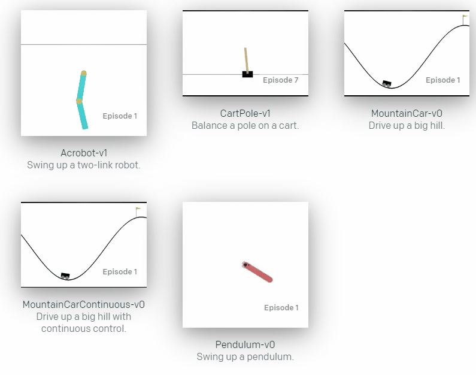
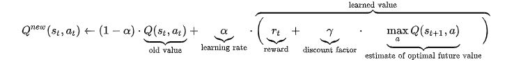

# Reinforcement-Learning

Reinforcement Learning with OpenAI gym

## What is OpenAI Gym?
OpenAI Gym is an environment that provides diverse game-like environments where we can play around with our reinforcement agents.

There are many environments. The cart pole environment, for example, is an environment where the goal is to balance the pole on the cart as long period as we can. If the pole tilts more than certain degrees the games is over.

For more information about OpenAI Gym:
https://github.com/openai/gym (OpenAI Gym Github)

The Wiki page on the Github page gives a detailed view on most of the environments.

## Q Learning
What is Q-learning? Q-learning is a reinforcement learning algorithm where the agent tries to learn a policy that teaches which actions to take under certain circumstances.This algorithm is based on [Markov decision process](https://en.wikipedia.org/wiki/Markov_decision_process) and here is an brief explanation of the math that goes behind Q-learning.

This is the formula used to calculate Q values and we create a table of Q values where each row is a state and each column is an possible action.

